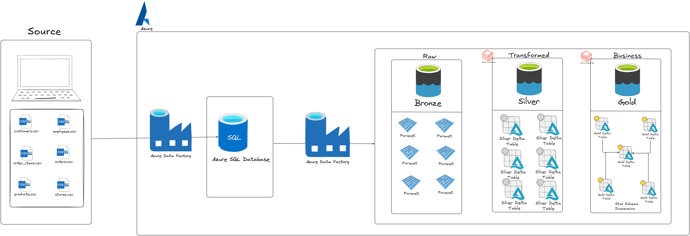

# Walmart_Data_Engineer_Project

Building a Data Engineering pipeline using Walmart datasets to perform data ingestion, transformation, and loading, producing clean and business-ready data for reporting and analysis.

## 🚀 Project Overview

The project implements a cloud-based data pipeline for Walmart retail data, covering data ingestion, incremental processing, transformation, dimensional modelling, and historical data tracking.

The pipeline processes six entities: customers, stores, products, employees, orders, and order items.

Azure Data Factory uses a **Self-Hosted Integration Runtime (SHIR)** to access locally stored CSV files and load the data into Azure SQL Database. The SQL tables serve as the initial staging layer before data is transferred to ADLS Gen2.

Incremental ingestion is implemented using the source-provided `updated_timestamp` column. The pipeline compares source update timestamps with the maximum timestamp available in the corresponding SQL staging table to identify newer records for ingestion.

The data is stored in Parquet format in the Bronze layer of ADLS Gen2. Azure Databricks and PySpark are then used to clean, transform, and incrementally process the datasets into Delta tables in the Silver layer.

The Silver datasets are combined into an **Order-Based One Big Table (OBT)**, which consolidates order, order-item, customer, product, store, and employee information. The OBT is then used to create Gold fact and dimension tables.

The Gold layer implements custom **Slowly Changing Dimension Type 2 (SCD Type 2)** logic to maintain current and historical versions of dimension records.

The project follows the **Medallion Architecture**, separating ingestion, transformation, and analytical modelling into Bronze, Silver, and Gold layers.

## 🏗️ Architecture

Azure Data Factory orchestrates the ingestion and Databricks processing workflows.

## 🛠️ Resources & Technologies Used

* **Microsoft Azure**
* **Azure Data Factory (ADF)**
* **Self-Hosted Integration Runtime (SHIR)**
* **Azure SQL Database**
* **Azure Data Lake Storage Gen2 (ADLS Gen2)**
* **Azure Databricks**
* **PySpark**
* **Spark SQL**
* **Delta Lake**
* **Python**
* **Jinja Templating**
* **Medallion Architecture**
* **Parquet**
* **Git and GitHub**

## 🥉 Bronze Layer

The Bronze layer stores ingested Walmart retail data in ADLS Gen2 in Parquet format.

Azure Data Factory transfers data from the corresponding Azure SQL staging tables to the Bronze layer.

### Ingestion Workflow

* Uses a Self-Hosted Integration Runtime to access local CSV files.
* Loads source data into Azure SQL Database tables under the `bronze` schema.
* Performs an initial load when the corresponding SQL table is empty.
* Uses the source-provided `updated_timestamp` column as the incremental watermark.
* Identifies records newer than the maximum timestamp available in the SQL staging table.
* Transfers the selected data to entity-specific folders in the Bronze container.

This approach reduces unnecessary data movement by avoiding repeated full loads when the destination already contains data.

## 🥈 Silver Layer

The Silver layer is developed using Azure Databricks, PySpark, Spark SQL, and Delta Lake.

The Bronze Parquet datasets are read and transformed before being stored as Delta tables in ADLS Gen2.

### Transformations and Processing

* Reads the Bronze datasets for each entity.
* Applies data cleaning and the required transformations.
* Uses `updated_timestamp` to identify records newer than the latest processed timestamp in Silver.
* Uses `DENSE_RANK()` to identify the latest applicable record versions according to the configured business key and timestamp.
* Uses Delta Lake `MERGE` operations to update existing records and insert new records.
* Stores the processed entity datasets as Delta tables in the Silver layer.

The Bronze-to-Silver workflow is orchestrated through Azure Data Factory.

### Order-Based One Big Table (OBT)

After the individual Silver tables are prepared, they are joined to create a consolidated Order-Based One Big Table.

The OBT combines data from:

* Orders
* Order items
* Customers
* Products
* Stores
* Employees

The OBT is stored as a Delta table in the Silver layer and serves as the input for Gold processing.

**OBT grain:** One row per order item.

Because an order can contain multiple items, order-level and customer-level attributes may repeat across multiple OBT rows. This structure supports the creation of both descriptive dimension tables and an order-item-level fact table.

## 🥇 Gold Layer

The Gold layer contains fact and dimension tables designed for analytical use.

The tables are generated from the Silver OBT using Spark SQL and parameterized query generation with Jinja templates.

### Dimension Tables

* `dim_customers`
* `dim_employees`
* `dim_orders`
* `dim_products`
* `dim_stores`

### Fact Table

* `fact_orders`

The dimension tables contain descriptive attributes for the corresponding business entities. The fact table contains order-item-level transactional information, including the relevant business keys and measures.

### Slowly Changing Dimension Type 2 (SCD Type 2)

Custom SCD Type 2 logic is implemented to preserve historical dimension versions rather than simply overwriting previous attribute values.

The processing follows these steps:

1. Identifies new entities and entities with newer source update timestamps.
2. Marks the existing current dimension record as `Historical` when a newer version is detected.
3. Inserts the new dimension version with the status `Updated`.
4. Retains previous versions for historical tracking.

The `Updated` and `Historical` values are custom status labels used by this implementation.

The Gold fact and dimension tables are stored in ADLS Gen2 in Delta Lake format and registered in the Databricks Gold schema.

## 🔄 Incremental Data Processing

Incremental processing is implemented at multiple stages of the pipeline.

### Azure SQL to Bronze

Azure Data Factory uses the source-provided `updated_timestamp` column to identify records newer than the maximum timestamp available in the corresponding SQL staging table.

### Bronze to Silver

The Silver processing compares Bronze timestamps against the latest processed timestamp in the Silver table. Newer records are processed through Delta Lake merge logic to update matching business keys or insert new records.

### Silver to Gold

The Gold dimension processing compares incoming entity timestamps with existing dimension versions to identify new versions, expire current records, and insert updated versions.

This multi-stage approach demonstrates incremental data processing across ingestion, transformation, and dimensional modelling.

Timestamp-based incremental processing requires careful handling of late-arriving records, equal timestamps, and failed pipeline runs. These are important considerations when extending the project for production workloads.

## 🎯 Project Objectives

The main objectives of this project are to demonstrate:

* End-to-end cloud data engineering using Azure services.
* Source ingestion through Azure Data Factory and SHIR.
* Relational staging using Azure SQL Database.
* Watermark-based incremental ingestion.
* Data lake storage using ADLS Gen2.
* Bronze, Silver, and Gold medallion architecture.
* Distributed transformations using PySpark and Spark SQL.
* Delta Lake merge and upsert operations.
* Consolidation of multiple datasets into an OBT.
* Fact and dimension modelling.
* Custom SCD Type 2 historical data tracking.
* Pipeline orchestration across Azure services.

## 💡 Design Decisions

* **Azure Data Factory:** Azure Data Factory is used to orchestrate ingestion and Databricks processing.
* **Azure SQL staging:** Source data is initially loaded into Azure SQL Database before being transferred to ADLS Gen2.
* **Parquet in Bronze:** Ingested datasets are stored in Parquet format.
* **Delta Lake in Silver and Gold:** Delta tables support merge-based processing and curated datasets.
* **Custom transformation logic:** PySpark, Spark SQL, and Jinja templates are used to implement transformations and generate queries.
* **Custom SCD Type 2 processing:** Explicit SQL operations manage current and historical dimension versions.

These choices adapt the project's data engineering concepts to an Azure-based architecture.

## 🔮 Future Improvements

Potential enhancements for a more production-oriented implementation include:

* Automated data-quality checks and validation frameworks.
* Centralized pipeline monitoring, logging, and alerting.
* Improved retry, recovery, and idempotency handling.
* Stronger watermark handling for late-arriving records and equal timestamps.
* Automated deployment and environment-specific configuration.
* Metadata-driven ingestion for additional source entities.
* Automated tests for fact and dimension relationships and SCD Type 2 behaviour.

These are potential future improvements, not claims about existing project functionality.

## 🔗 Connect with Me

